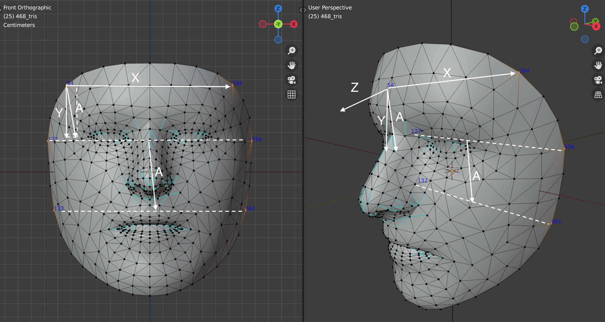

# DFKI - Sign Language - Video Processing Tools

This project aggregates a set of video analysis libraries and picks the best of their features for analysing human body movement with the goal of extracting relevant information for **sign language analysis** (i.e.: hands, fingers, face, lips, head, upper-body).

The outcome is a set of command-line tools and procedures taking a video as input, and producing as output other videos or a stream of numerical features.
The scripts are architected to be chained with dependency tools like [Make](https://www.gnu.org/software/make/).

The code relies on a number of body/face analysis libraries:

* [MediaPipe](https://mediapipe.dev) -- to extract body and face landmarks
* [OpenPose](https://github.com/CMU-Perceptual-Computing-Lab/openpose), ...) -- for full body 3D landmarks extraction
* [kkroening ffmpeg python](https://kkroening.github.io/ffmpeg-python/) -- to en/decode videos
* ... more to come


## Installation

Clone the repository and setup a python environment for it (Tested with v3.7).

```sh
python3 -m venv p3env-videotools
source p3env-videotools/bin/activate
git clone https://github.com/DFKI-SignLanguage/VideoProcessingTools.git
cd VideoProcessingTools
pip install -r requirements.txt
```

## Scripts

Here is the list of scripts and their description.

In general, all the scripts are designed to be executed as modules, but their core functionality is available also as function.

### Extract Face Bounds

This scripts analyse a video in order to identify the rectangle containing the face of the person throughout the whole video.
It is useful on videos showing the full body of the interpreter because some software, like MediaPipe, do not work well when the face occupies only a small portion of the video.

```
python -m dfki_sl_videotools.extract_face_bounds --help
usage: extract_face_bounds.py [-h] --invideo INVIDEO --outbounds OUTBOUNDS
                              [--outvideo OUTVIDEO] [--head-focus]

Get the bounding box of the face throughout a video

optional arguments:
  -h, --help            show this help message and exit
  --invideo INVIDEO     Path to a video file showing a sign language
                        interpreter. Hence, we assume that there is a face
                        always present and visible.
  --outbounds OUTBOUNDS
                        Path for a JSON output file: a JSON structure
                        containing the pixel-coordinates of the smallest
                        rectangle containing the face of the person throughout
                        the whole video. The rectangle must hold the same
                        proportions of the original video (e.g.: 4:3, 16:9).
                        Output has the format: { "x": int, "y": int, "width":
                        int, "height": int}.
  --outvideo OUTVIDEO   Path for an (optional) videofile showing the original
                        videoand an overlay of the region selected as bounds.
  --head-focus          Before trying to recognize the face, try to recognize
                        the head zone of a full body. Useful when the face is
                        too small but the body is visible. However, body
                        recognition is much slower.
```

### Crop Video

```
python -m dfki_sl_videotools.crop_video --help
usage: crop_video.py [-h] --invideo INVIDEO --inbounds INBOUNDS --outvideo
                     OUTVIDEO

Crop a video at a specified rectangular area.

optional arguments:
  -h, --help           show this help message and exit
  --invideo INVIDEO    Path to the input videofile
  --inbounds INBOUNDS  Path to a JSON file containing the bounds information
                       for cropping. Format is: { "x": int, "y": int, "width":
                       int, "height": int}
  --outvideo OUTVIDEO  Path for the output videofile, showing the cropped area
```

_Warning!!!_ The resolution of the output video might differ from the width/height specified in the JSON file. This is due to limitations of some codecs.

### Extract Face Mesh

```
python -m dfki_sl_videotools.extract_face_data --help
usage: extract_face_data.py [-h] --inframes INFRAMES --outlandmarks
                            OUTLANDMARKS
                            [--outnosetipposition OUTNOSETIPPOSITION]
                            [--outfacerotation OUTFACEROTATION]
                            [--outfacescale OUTFACESCALE]
                            [--outcompositeframes OUTCOMPOSITEFRAMES]
                            [--normalize-landmarks]

Uses mediapipe to extract the face mesh data from the frames of a video.

optional arguments:
  -h, --help            show this help message and exit
  --inframes INFRAMES, --invideo INFRAMES
                        Path to a vide or image directory containing the face
                        of a person.
  --outlandmarks OUTLANDMARKS
                        Path to the output numpy array of size [N][468][3],
                        where N is the number of video frames, 468 are the
                        number of landmarks of the
                        [MediaPipe](https://mediapipe.dev) face mesh, and 3 is
                        to store <x,y,z> 3D coords. If no faces are detected,
                        all values are NaN! If more faces are detected, only
                        the first in the mediapipe list is used.
  --outnosetipposition OUTNOSETIPPOSITION
                        Path to an output numpy array of shape [N][3] with the
                        x,y,z movement of the nose tip in space. N is the
                        number of video frames As for MediaPipe, X and Y
                        coordinates are normalized in the range [0,1] in the
                        frame size.
  --outfacerotation OUTFACEROTATION
                        Path to an output numpy array of shape [N][3][3] with
                        the 3x3 rotation of the face. N is the number of video
                        frames
  --outfacescale OUTFACESCALE
                        Path to the output numpy array of shape [N] with the
                        scaling of the face. N is the number of video frames.
                        The scaling factor needed to resize the vertical
                        distance within ear and jaw-base into 10 percent of
                        the height of the frame.
  --outcompositeframes OUTCOMPOSITEFRAMES, --outcompositevideo OUTCOMPOSITEFRAMES
                        Path to a videofile or directory for image files. Will
                        have the same resolution of the video, plus the
                        overlay of the face landmarks. The red landmarks are
                        printed by mediapipe. The blue landmarks, possibly
                        normalized, printed in the upper-left quadrant, are
                        the outputted values
  --normalize-landmarks
                        If specified, neutralizes the head translation,
                        rotation, and zoom. At each frame, a counter
                        -rotation, -translation, and -scaling are applied in
                        order to have: face nose facing the camera and head-
                        up, nose tip at the center of the frame, head of the
                        same size.
```

This scripts is able to give an estimation of the transformation of the face with respect to a reference _normalized_ position where:

* the nose tip is at the center of the screen;
* the head is vertical and the nose is pointing to the camera;
* the distance between the ears and the jaw base is at 10% of the height of the frame.

All of those transformations can be saved as numpy arrays.
If the normalization flag is active, reverse-transformations are applied and the landmarks are saved as normalized.

The normalization is performed assuming that some of the points at the border of the face have no (or very limited) deformation during the execution of facial expressions.
Hence, those points are used to compute a "rigid" orthogonal system. The advantage is that we don't need any other MediaPipe module to estimate the rotation of the head.
The following pic shows the vectors used for the normalization process. It helps understanding the implementation of the `compute_normalization_params()` function.



### Trim Video

```
python -m dfki_sl_videotools.trim_video --help                                      
usage: trim_video.py [-h] --invideo INVIDEO --outvideo OUTVIDEO --startframe
                     STARTFRAME --endframe ENDFRAME

Trims a video file.

optional arguments:
  -h, --help            show this help message and exit
  --invideo INVIDEO     Input video filepath
  --outvideo OUTVIDEO   Output video filepath
  --startframe STARTFRAME
                        First frame to retain (counting from 1)
  --endframe ENDFRAME   Last frame to retain (counting from 1)
```

## Examples

There examples in the `Examples` directory. Some test videos are in this same package under `dfki_sl_videotools/data`.

## Testing

Test modules/functions are implemented using [pytest](https://docs.pytest.org/).
After setting up the python environment, open a terminal and... 

    cd .../VideoProcessingTools
    pytest -s
    # The -s option allows printing some informative stdout on the console.

## Software details

### Frame production and consumption

The framework has a unified interface to process frames coming either from a videofile or from a directory.
Function and classes are defined in the `datagen` module.

The production of frames is based on a top-level abstract class `FrameProducer` exposing a method `frames`
The `frames()` method is a generator that returns instances of numpy `ndarray` containing RGB images. 

```
class FrameProducer(ABC):

    @abstractmethod
    def frames(self) -> np.ndarray:
        [...]
```

It has two subclasses:

```
FrameProducer
|- ImageDirFrameProducer  # produces frames from files in a directory
|- VideoFrameProducer     # produces frames from a video
```

Similarly, the "consumption" of frames can end in writing files in a directory, or building a videofile

```
FrameConsumer(ABC):

    @abstractmethod
    def consume(self, frame: np.ndarray):

|- ImageDirFrameConsumer  # saves frames as image files in a directory
|- VideoFrameConsumer     # adds frames to a video
```

In addition, both `FrameProducer`s and `FrameConsumer`s implement the `__enter__()` and `__exit__()` methods, so to be used in `with` contexts.

With this scheme, the transformation and transfer of frames can be implemented with a recipe like this:

```python
from dfki_sl_videotools.datagen import ImageDirFrameProducer, VideoFrameConsumer
import numpy as np

with ImageDirFrameProducer(source_dir="my/frames/") as prod,\
     VideoFrameConsumer(video_out="my_final_video.mp4") as cons:

    # For each frame in the directory
    for frame in prod.frames():

        assert type(frame) == np.ndarray
        width, height, _ = frame.shape
        # Transform the frame the way you want
        # [...]

        # Feed the frame to output video
        cons.consume(frame=frame)
```

or course, any of combination of _image_dir_ or _video_ can be used for input or output.

There are also a couple of factory methods, automatically determining if the source, or destination is a directory or a video file.
For example:

```python
from dfki_sl_videotools.datagen import create_frame_producer, create_frame_consumer

with create_frame_producer(dir_or_video="my/frames/") as prod,\
     create_frame_consumer(dir_or_video="my_final_video.mp4") as cons:
        # [...]
        pass
```