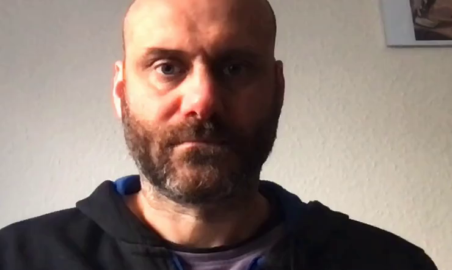

# DFKI - Sign Language - Video Processing Tools

This project aggregates a set of video analysis libraries and picks the best of their features for analysing human body movement with the goal of extracting relevant information for **sign language analysis** (i.e.: hands, fingers, face, lips, head, upper-body).

The outcome is a set of command-line tools and procedures taking a video as input, and producing as output other videos or a stream of numerical features.
The scripts are architected to be chained with dependency tools like [Make](https://www.gnu.org/software/make/).

The code relies on a number of body/face analysis libraries:

* [MediaPipe](https://mediapipe.dev) -- to extract body and face landmarks
* [MTCNN](https://github.com/ipazc/mtcnn) -- to extract face bounds
* [kkroening ffmpeg python](https://kkroening.github.io/ffmpeg-python/) -- to en/decode videos
* ... more to come


## Installation

Clone the repository and setup a python environment for it (Tested with v3.11).

```sh
python3 -m venv p3env-videotools
source p3env-videotools/bin/activate
git clone https://github.com/DFKI-SignLanguage/VideoProcessingTools.git
cd VideoProcessingTools
pip install -r requirements.txt
```

## Scripts

Here is the list of scripts and their description.

In general, all the scripts are designed to be executed as modules, but their core functionality is available also as function.

### Extract Face Bounds

This scripts analyse a video in order to identify the rectangle containing the face of the person _throughout the whole video_. Hence, by cropping this area you will have the face always visible in the video area, without moving background.

It is useful on videos showing the full body of the interpreter because some software, like MediaPipe, do not work well when the face occupies only a small portion of the video.

```
python -m slvideotools.extract_face_bounds --help
```

Watch here the [extract_face_bound help text](Docs/Help/extract_face_bounds.txt)


==>
Bounding Box JSON dictionary

```
{
    "x": 227,
    "y": 200,
    "width": 741,
    "height": 442
}
```

### Draw BBox

Draws a rectangle as overlay of an input frame sequence

Watch here the [draw_bbox help text](Docs/Help/draw_bbox.txt)

 + `{"x": 227, "y": 200, "width": 741, "height": 442 }` ==> 


### Crop Video

Takes as input a video and a bounding rectangle description (as JSON file).
Outputs a cropped video.

```
python -m slvideotools.crop_video --help
```

Watch here the [crop_video help text](Docs/Help/crop_video.txt)


 + `{"x": 227, "y": 200, "width": 741, "height": 442 }` ==> 


_Warning!!!_ The resolution of the output video might differ from the width/height specified in the JSON file. This is due to limitations of some codecs.

### Extract Face Mesh

Finds a face in the video and uses MediaPipe to extract landmarks and other head transformation data.

```
python -m slvideotools.extract_face_data --help
```

Watch here the [extract_face_data help text](Docs/Help/extract_face_data.txt)


 ==> 

For a reference about the landmark ID and its location on the face, please see the official MediaPipe docs [Here](https://raw.githubusercontent.com/google/mediapipe/master/mediapipe/modules/face_geometry/data/canonical_face_model_uv_visualization.png).

This scripts is able to give an estimation of the transformation of the face with respect to a reference _normalized_ position where:

* the nose tip is at the center of the screen;
* the head is vertical and the nose is pointing to the camera;
* the distance between the ears and the jaw base is at 10% of the height of the frame.

All of those transformations can be saved as numpy arrays.
If the normalization flag is active, reverse-transformations are applied and the landmarks are saved as normalized.

The normalization is performed assuming that some of the points at the border of the face have no (or very limited) deformation during the execution of facial expressions.
Hence, those points are used to compute a "rigid" orthogonal system. The advantage is that we don't need any other MediaPipe module to estimate the rotation of the head.
The following pic shows the vectors used for the normalization process. It helps understanding the implementation of the `compute_normalization_params()` function.


### Trim Video

Trims a video, i.e., retains only a subrange of frames.

```
python -m slvideotools.trim_video --help                                      
```

Watch here the [trim_video help text](Docs/Help/trim_video.txt)

### Compute Motion Energy

Calculates the "motion energy" of the input frame sequence.

```
python -m slvideotools.compute_motion_energy --help
```

Watch here the [compute_motion_energy help text](Docs/Help/compute_motion_energy.txt)

The motion energy is a mono-dimensional curve.
Each sample is calculated by first computing the optical flow between consecutive frames and then summing up the magnitude of each flow vector.

==>


## Command Line Interface (CLI) and Make Examples

There are examples in the `Examples` directory. Some test videos are in this same package under `slvideotools/data`.


## Module usage

Some more details for developers wanting to use the functionalities as module functions rather than CLI.

### Frame production and consumption

The framework has a unified interface to process frames coming either from a videofile or from a directory.
Function and classes are defined in the `datagen` module.

The production of frames is based on a top-level abstract class `FrameProducer` exposing a method `frames`
The `frames()` method is a generator that returns instances of numpy `ndarray` containing RGB images. 

```python
class FrameProducer(ABC):

    @abstractmethod
    def frames(self) -> np.ndarray:
        pass

    @abstractmethod
    def close() -> None:
        pass    
```

It has two subclasses:

```python
FrameProducer
|- ImageDirFrameProducer # produces frames from files in a directory
|- VideoFrameProducer     # produces frames from a video
```

Similarly, the "consumption" of frames can end in writing files in a directory, or building a videofile

```python
FrameConsumer(ABC):

    @abstractmethod
    def consume(self, frame: np.ndarray):
        pass

    @abstractmethod
    def close() -> None:
        pass    


|- ImageDirFrameConsumer  # saves frames as image files in a directory
|- VideoFrameConsumer     # adds frames to a video
```

In addition, both `FrameProducer`s and `FrameConsumer`s implement the `__enter__()` and `__exit__()` methods, so to be used in `with` contexts.

The transformation and transfer of frames can be implemented with a recipe like this:

```python
from slvideotools.datagen import ImageDirFrameProducer, VideoFrameConsumer
import numpy as np

with ImageDirFrameProducer(source_dir="my/frames/") as prod,\
     VideoFrameConsumer(video_out="my_final_video.mp4") as cons:

    # For each frame in the directory
    for frame in prod.frames():

        assert type(frame) == np.ndarray
        width, height, depth = frame.shape
        assert depth == 3
        # Transform the frame the way you want
        # new_frame = [...]

        # Feed the frame to output video
        cons.consume(frame=new_frame)
```

of course, any combination of _image_dir_ or _video_ can be used for input or output.

There are also a couple of factory methods, automatically determining if the source, or destination, is a directory or a video file.
For example:

```python
from slvideotools.datagen import create_frame_producer, create_frame_consumer

with create_frame_producer(dir_or_video="my/frames/") as prod,\
     create_frame_consumer(dir_or_video="my_final_video.mp4") as cons:
        
        for frame in prod.frames():
            # [...]
```

## Development

### Environment preparation

Tested with Python 3.11:

Install the frozen requirements:

    pip install -r requirements.txt

OR freshly install the following packages:

```
pip install numpy==1.26.4
pip install pillow==11.3.0

pip install ffmpeg-python==0.2.0
pip install opencv-python==4.9.0.80

pip install mediapipe==0.10.21
pip install tensorflow==2.19.0
pip install mtcnn==1.0.0

pip install pytest==8.4.1
```

To use GPU on a Mac:

```
python -m pip install tensorflow-metal
```

### Documentation update

There is a script helping in automatically updating the documentation.

Every time you update the _Help_ description of a command, or if you add or remove commands, please invoke:

    bash ./update_docs.sh

This will update the documentation with each command `--help` output.

### Testing

Test modules/functions are implemented using [pytest](https://docs.pytest.org/).
After setting up the python environment, open a terminal and... 

    cd .../VideoProcessingTools
    pytest -s
    # The -s option allows printing some informative stdout on the console.

## Cite as ...

Nunnari, F., 2022. A software toolkit for pre-processing sign language video streams, in: Seventh International Workshop on Sign Language Translation and Avatar Technology (SLTAT). Marseille, France.

```
@inproceedings{nunnari2022VideoProcTools,
	address = {Marseille, France},
	title = {A software toolkit for pre-processing sign language video streams},
	booktitle = {Seventh {International} {Workshop} on {Sign} {Language} {Translation} and {Avatar} {Technology} ({SLTAT})},
	author = {Nunnari, Fabrizio},
	month = jun,
	year = {2022},
	keywords = {open source toolkit, sign language, software engineering, video pre-processing},
}
```

The use of video motion energy to align with motion capture data is described in a SLTAT 2023 paper: https://ieeexplore.ieee.org/document/10193528

```
@INPROCEEDINGS{nunnari23SLTAT-VideoAlignment,
  author={Nunnari, Fabrizio and Ameli, Mina and Mishra, Shailesh},
  booktitle={2023 IEEE International Conference on Acoustics, Speech, and Signal Processing Workshops (ICASSPW)}, 
  title={Automatic Alignment Between Sign Language Videos And Motion Capture Data: A Motion Energy-Based Approach}, 
  year={2023},
  pages={1-5},
  doi={10.1109/ICASSPW59220.2023.10193528}}
```


## Links

* This software is supported by the [German Research Center for Artificial Intelligence (DFKI)](https://www.dfki.de).
* Development partially supported by the BMBF (German Federal Ministry of Educationand Research) in the project SOCIALWEAR (Socially Interactive Smart Fashion, DFKI Kst 22132).
* Development partially supported by the EU Horizon 2020 program within the [EASIER project](https://www.project-easier.eu) (Grant agreement ID: 101016982).
